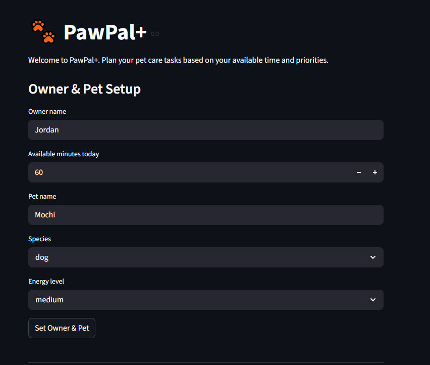
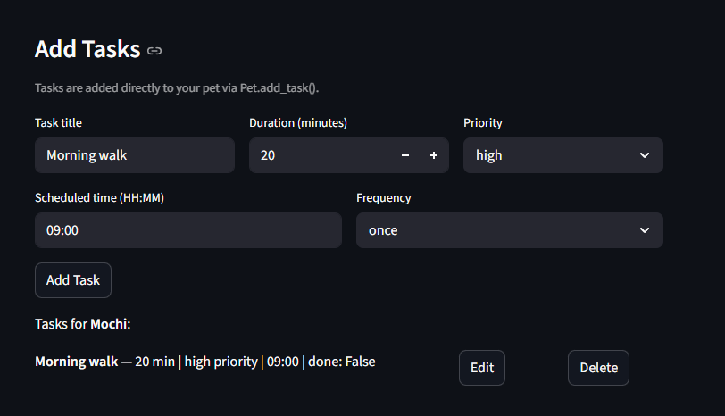
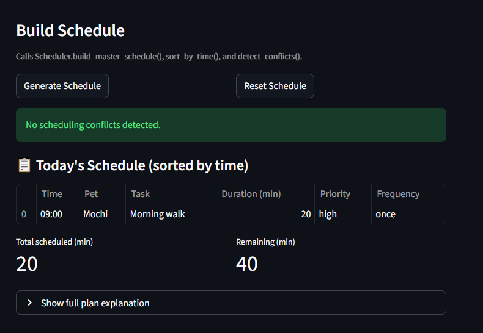
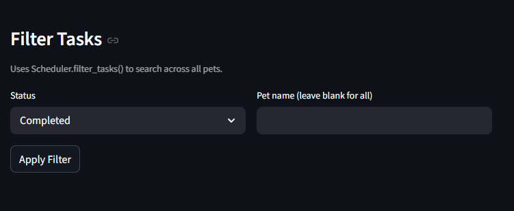
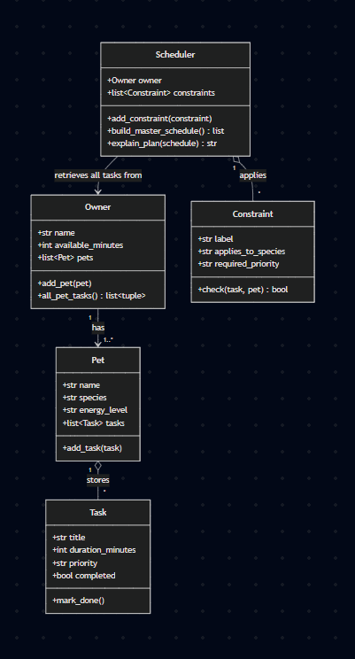

# PawPal+

PawPal+ is a Streamlit application for pet care scheduling, extended with an **AI Care Advisor** powered by the Claude API. The advisor uses a multi-step agentic workflow — including RAG from a local knowledge base — to detect gaps in a pet's care routine and suggest new tasks with guardrail validation.

---

## Base Project

The original PawPal+ system was a pure-algorithm pet scheduler. It allowed owners to:
- Create pet profiles (name, species, energy level)
- Add tasks with priority, duration, and scheduled time
- Generate an optimized daily schedule using a greedy priority-first algorithm
- Detect time conflicts and filter tasks by status or pet

The extension adds real AI reasoning on top of that foundation.

---

## Demo Screenshots

**1 - Owner & Pet Setup**



**2 - Task List**



**3 - Generated Schedule & Conflict Detection**



**4 - Filter Tasks**



---

## Features

### Original Scheduling Features
- **Owner & Pet setup** — Enter the owner's name, available minutes, and add pets with species and energy level.
- **Task management** — Add, edit, and delete tasks with title, duration, priority, scheduled time, and frequency.
- **Priority-based scheduling** — `Scheduler.build_master_schedule()` sorts tasks by priority and greedily fits them within the time budget.
- **Conflict detection** — `Scheduler.detect_conflicts()` flags tasks sharing the same time slot.
- **Recurring tasks** — Daily and weekly tasks auto-generate the next occurrence when marked complete.
- **Task filtering** — Filter tasks by completion status and/or pet name.
- **Plan explanation** — Human-readable summary of what was scheduled and what was skipped.

### New AI Features
- **AI Care Advisor** — Gemini-powered 5-step agent that analyzes a pet's profile and suggests missing care tasks.
- **RAG Knowledge Base** — Species-specific care guidelines retrieved at runtime to ground suggestions in factual advice.
- **Guardrail Validation** — Every AI suggestion is validated before reaching the user (duration, priority, frequency, title).
- **Evaluation Harness** — `eval_harness.py` runs 30+ predefined checks and prints a scored pass/fail report.

---

## System Architecture

```
┌─────────────────────────────────────────────────────────┐
│                    User (Streamlit UI)                   │
│                        app.py                           │
└──────────────────┬──────────────────┬───────────────────┘
                   │                  │
          ┌────────▼────────┐  ┌──────▼──────────────────┐
          │  pawpal_system  │  │      ai_advisor.py       │
          │  (Scheduler)    │  │                          │
          │                 │  │  Step 1: Profile Analysis│
          │ build_schedule  │  │  Step 2: RAG Retrieval   │
          │ detect_conflicts│  │  Step 3: Gap Detection   │
          │ sort_by_time    │  │  Step 4: Claude API call │
          │ filter_tasks    │  │  Step 5: Guardrails      │
          └─────────────────┘  └──────────┬───────────────┘
                                          │
                             ┌────────────▼────────────┐
                             │    pet_care_kb.json      │
                             │  (RAG Knowledge Base)    │
                             │  dog / cat / other       │
                             │  5 care categories each  │
                             └────────────┬─────────────┘
                                          │
                             ┌────────────▼────────────┐
                             │   Google Gemini API      │
                             │  gemini-1.5-flash        │
                             │  (free tier)             │
                             │  few-shot specialization │
                             └─────────────────────────┘

                  ┌──────────────────────────────────────┐
                  │          eval_harness.py              │
                  │  30+ checks across 4 sections        │
                  │  Outputs PASS/FAIL summary with score │
                  └──────────────────────────────────────┘
```

---

## Installation & Setup

```bash
# 1. Clone the repo and enter the directory
git clone https://github.com/ANDYLIN05/applied-ai-system-project.git
cd applied-ai-system-project

# 2. Create and activate a virtual environment
python -m venv .venv
# macOS/Linux:
source .venv/bin/activate
# Windows PowerShell:
.venv\Scripts\activate

# 3. Install dependencies
pip install -r requirements.txt

# 4. Set your Google Gemini API key (free — get one at aistudio.google.com)
# Create a .env file in the project folder with:
echo GOOGLE_API_KEY=your-key-here > .env

# 5. Run the Streamlit app
streamlit run app.py

# 6. Run unit tests
pytest

# 7. Run the evaluation harness
python eval_harness.py
```

---

## Sample Input / Output

### Example 1 — AI advisor for an under-covered dog

**Setup:** Pet "Buddy", species: dog, energy: high. One existing task: "Feed kibble" (10 min, high priority).

**AI Advisor output:**
```
Step 1 — Profile Analysis:
  Buddy is a high-energy dog with 1 existing task(s).

Step 2 — Knowledge Retrieval:
  Loaded 5 care categories for dogs: exercise, nutrition, grooming, health, socialization.

Step 3 — Gap Detection:
  Found 4 uncovered care area(s): exercise, grooming, health, socialization.

Step 4 — Suggestion Generation:
  Claude returned 4 suggestion(s) covering: exercise, grooming, health, socialization.

Step 5 — Validation & Guardrails:
  4/4 suggestions passed validation.

Suggested Tasks:
  Morning Walk      — 45 min | high priority   | daily
  Brush Coat        — 10 min | medium priority  | weekly
  Flea Prevention   — 5 min  | high priority    | once
  Training Session  — 15 min | medium priority  | daily
```

### Example 2 — AI advisor finds no gaps for a well-covered cat

**Setup:** Pet "Mochi", species: cat. Tasks: laser play, feed wet food, clean litter, vet checkup, bonding time.

**AI Advisor output:**
```
Step 3 — Gap Detection:
  Found 0 uncovered care area(s): none — all areas appear covered.

Step 4 — Suggestion Generation:
  Skipped — no gaps found.

Result: All care areas are already covered — no new tasks needed!
```

### Example 3 — Guardrail blocking an invalid suggestion

**Input from Claude (hypothetical):** `{"title": "", "duration_minutes": 999, "priority": "extreme", "frequency": "monthly"}`

**Guardrail output:**
```
  Suggestion missing a title — skipped.            ← empty title rejected
  'Ultra Hike': duration 999 min out of range      ← duration rejected
  'Nap': invalid priority 'extreme' → medium       ← defaulted with warning
  'Bath': invalid frequency 'monthly' → once       ← defaulted with warning
```

### Example 4 — Evaluation harness (offline sections)

```
────────────────────────────────────────────────────────────
  1. Core Scheduling Logic
────────────────────────────────────────────────────────────
  [PASS] High-priority task scheduled first
  [PASS] Time budget respected (<=60 min)
  [PASS] Oversized task (90 min) excluded from 60-min budget
  [PASS] No false conflict for distinct scheduled times
  [PASS] Conflict detected for two tasks at same time
  [PASS] Conflict warning names the clashing time slot
  [PASS] Daily task marked complete
  [PASS] Daily recurrence creates next-day task
  [PASS] Recurrence task is not pre-completed
  [PASS] explain_plan returns 'no tasks' message for empty schedule

────────────────────────────────────────────────────────────
  2. AI Advisor Guardrails (offline)
────────────────────────────────────────────────────────────
  [PASS] Valid suggestion passes guardrail
  [PASS] Empty title rejected
  [PASS] Duration > 240 min rejected
  [PASS] Duration = 0 min rejected
  [PASS] Non-integer duration rejected
  [PASS] Invalid priority defaults to medium (not rejected)
  [PASS] Warning issued for invalid priority
  [PASS] Invalid frequency defaults to once (not rejected)
  [PASS] Warning issued for invalid frequency
  [PASS] Oversized title truncated to 100 chars (not rejected)

────────────────────────────────────────────────────────────
  3. RAG Gap Detection
────────────────────────────────────────────────────────────
  [PASS] Dog facts loaded from knowledge base
  [PASS] Cat facts loaded from knowledge base
  [PASS] Unknown species falls back to 'other' facts
  [PASS] All care areas flagged as gaps for pet with zero tasks
  [PASS] Exercise gap closes after adding a walk task
  [PASS] Nutrition gap closes after adding a feed task
  [PASS] Grooming gap closes after adding a brush task

============================================================
  FINAL SCORE: 27/27 passed  (100%)
============================================================
```

---

## Project Structure

```
applied-ai-system-project/
├── app.py               # Streamlit UI (includes AI advisor section)
├── pawpal_system.py     # Core data models and scheduling logic
├── ai_advisor.py        # AI Care Advisor — agentic workflow + RAG + guardrails
├── pet_care_kb.json     # RAG knowledge base (dog / cat / other care facts)
├── eval_harness.py      # Evaluation script with pass/fail scoring
├── main.py              # CLI entry point
├── requirements.txt     # Dependencies (streamlit, pytest, anthropic)
├── tests/
│   └── test_pawpal.py   # pytest unit tests for core scheduling
├── assets/
│   └── uml_final.PNG    # Original UML class diagram
└── reflection.md        # Project reflection and AI collaboration notes
```

---

## UML Diagram


