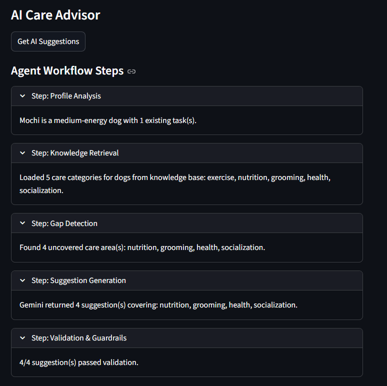
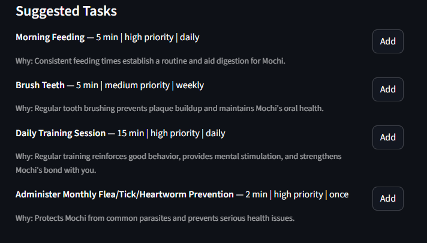
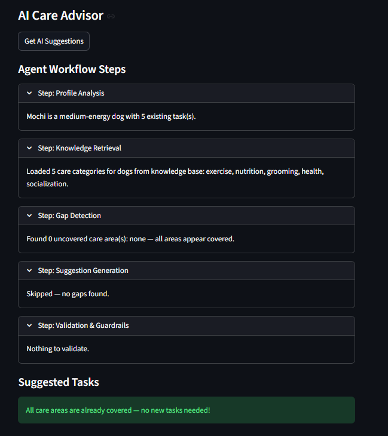
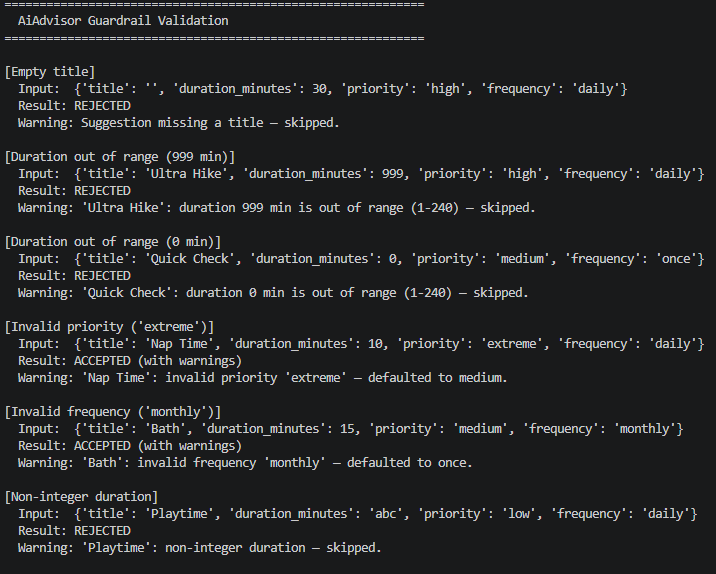
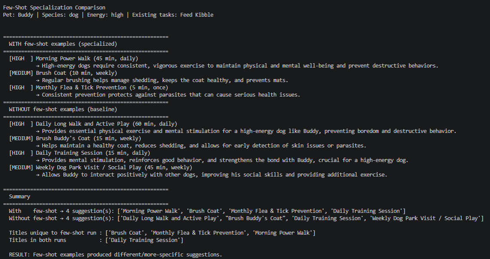
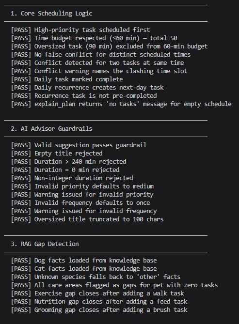
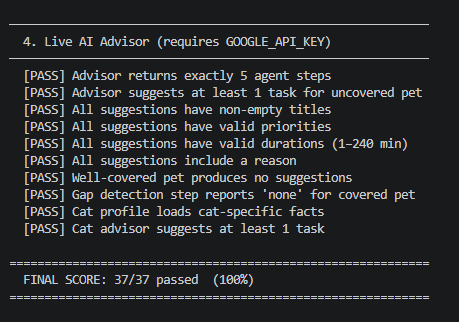

# PawPal+

PawPal+ is a Streamlit application for pet care scheduling, extended with an **AI Care Advisor** powered by the Google Gemini API. The advisor uses a multi-step agentic workflow including RAG from a local knowledge base to detect gaps in a pet's care routine and suggest new tasks with guardrail validation.

---

## Base Project

The original PawPal+ system was a pure-algorithm pet scheduler. It allowed owners to:
- Create pet profiles (name, species, energy level)
- Add tasks with priority, duration, and scheduled time
- Generate an optimized daily schedule using a greedy priority first algorithm
- Detect time conflicts and filter tasks by status or pet

The extension adds real AI reasoning on top of that foundation.

---

## Demo Screenshots

**1 - Owner & Pet Setup**


**2 - Task List**


**3 - Generated Schedule & Conflict Detection**


**4 - Filter Tasks**


---

## Features

### Original Scheduling Features
- **Owner & Pet setup** - Enter the owner's name, available minutes, and add pets with species and energy level.
- **Task management** - Add, edit, and delete tasks with title, duration, priority, scheduled time, and frequency.
- **Priority-based scheduling** - `Scheduler.build_master_schedule()` sorts tasks by priority and greedily fits them within the time budget.
- **Conflict detection** - `Scheduler.detect_conflicts()` flags tasks sharing the same time slot.
- **Recurring tasks** - Daily and weekly tasks auto-generate the next occurrence when marked complete.
- **Task filtering** - Filter tasks by completion status and/or pet name.
- **Plan explanation** - Human readable summary of what was scheduled and what was skipped.

### New AI Features
- **AI Care Advisor** - Gemini powered 5 step agent that analyzes a pet's profile and suggests missing care tasks.
- **RAG Knowledge Base** - Species specific care guidelines retrieved at runtime to ground suggestions in factual advice.
- **Guardrail Validation** - Every AI suggestion is validated before reaching the user (duration, priority, frequency, title).
- **Evaluation Harness** - `eval_harness.py` runs 30+ predefined checks and prints a scored pass/fail report.

---

## System Architecture

```
┌─────────────────────────────────────────────────────────┐
│                    User (Streamlit UI)                   │
│                        app.py                           │
└──────────────────┬──────────────────┬───────────────────┘
                   │                  │
          ┌────────▼────────┐  ┌──────▼──────────────────┐
          │  pawpal_system  │  │      ai_advisor.py       │
          │  (Scheduler)    │  │                          │
          │                 │  │  Step 1: Profile Analysis│
          │ build_schedule  │  │  Step 2: RAG Retrieval   │
          │ detect_conflicts│  │  Step 3: Gap Detection   │
          │ sort_by_time    │  │  Step 4: Gemini API call │
          │ filter_tasks    │  │  Step 5: Guardrails      │
          └─────────────────┘  └──────────┬───────────────┘
                                          │
                             ┌────────────▼────────────┐
                             │    pet_care_kb.json      │
                             │  (RAG Knowledge Base)    │
                             │  dog / cat / other       │
                             │  5 care categories each  │
                             └────────────┬─────────────┘
                                          │
                             ┌────────────▼────────────┐
                             │   Google Gemini API      │
                             │  gemini 2.5 flash        │
                             │  few-shot specialization │
                             └─────────────────────────┘

                  ┌──────────────────────────────────────┐
                  │          eval_harness.py             │
                  │  30+ checks across 4 sections        │
                  │  Outputs PASS/FAIL summary with score│
                  └──────────────────────────────────────┘
```

### Architecture Overview

The system has two parallel paths from the Streamlit UI. The deterministic path (`pawpal_system.py`) handles all task management, priority-based scheduling, conflict detection, and filtering entirely in Python with no external calls. The AI path (`ai_advisor.py`) runs a five step pipeline profile analysis, RAG retrieval from `pet_care_kb.json`, gap detection, a Gemini 2.5 Flash API call with few shot examples, and guardrail validation before returning suggestions the user can accept and add directly to the live schedule. The evaluation harness (`eval_harness.py`) is a standalone CLI script that tests both paths against 30+ predefined checks and prints a human readable pass/fail score. Sections 1-3 (scheduling logic, guardrails, RAG) run without an API key; Section 4 requires a live Gemini connection.

---

## Installation & Setup

```bash
# 1. Clone the repo and enter the directory
git clone https://github.com/ANDYLIN05/applied-ai-system-project.git
cd applied-ai-system-project

# 2. Create and activate a virtual environment
python -m venv .venv
# macOS/Linux:
source .venv/bin/activate
# Windows PowerShell:
.venv\Scripts\activate

# 3. Install dependencies
pip install -r requirements.txt

# 4. Set your Google Gemini API key (free - get one at aistudio.google.com)
# Create a .env file in the project folder with:
echo GOOGLE_API_KEY=your-key-here > .env

# 5. Run the Streamlit app
streamlit run app.py

# 6. Run unit tests
pytest

# 7. Run the evaluation harness
python eval_harness.py
```

---

## Sample Input / Output

### Example 1 - AI advisor for an under-covered dog

**Setup:** Pet "Mochi", species: dog, energy: medium. One existing task: "Morning Walk" (covering exercise only).

**Agent Workflow Steps:**



**Suggested Tasks:**



### Example 2 - AI advisor finds no gaps for a well-covered dog

**Setup:** Pet "Mochi", species: dog, energy: medium. All 5 care areas already covered by existing tasks.



### Example 3 - Guardrail blocking an invalid suggestion

**Input from Gemini (hypothetical):** `{"title": "", "duration_minutes": 999, "priority": "extreme", "frequency": "monthly"}`



### Example 4 - Few-shot specialization comparison

**Script:** `python few_shot_comparison.py`

WITH few-shot examples the advisor produces more specific, concise task titles (e.g. "Morning Power Walk", "Monthly Flea & Tick Prevention") with targeted reasoning. WITHOUT few shot the baseline produces longer, more generic titles (e.g. "Daily Long Walk and Active Play") and 4 suggestions instead of 3. The summary confirms unique titles in the few shot run, proving specialization measurably changes output.



### Example 5 - Evaluation harness (offline sections)






---

## Testing Summary

The project has two layers of testing. The pytest suite (`tests/test_pawpal.py`) covers 20 unit tests across task completion, recurrence logic, conflict detection, and scheduling edge cases  all 20 pass. The evaluation harness (`eval_harness.py`) runs 30+ checks across four sections: core scheduling logic, AI advisor guardrails, RAG gap detection, and live Gemini API behavior. The offline sections (Sections 1-3) pass fully without an API key. The live section (Section 4) requires a valid `GOOGLE_API_KEY` and passes when the API is available.

The main reliability weakness discovered during testing was in gap detection: keyword matching fails when users name tasks in unexpected ways (e.g., "Outdoor adventure" does not trigger the exercise covered check, even though exercise is covered). Guardrails performed better than expected soft corrections handled synonyms like "urgent" and "bi-weekly" cleanly, while hard rejections correctly blocked empty titles and durations above 240 minutes.

---

## Design Decisions

**Greedy algorithm over knapsack optimizer** - A full knapsack-style packing algorithm would produce a more optimal schedule but would be significantly harder to debug and explain. For a personal pet care app where transparency matters more than micro optimization, the greedy priority first approach is the right tradeoff.

**Flat JSON knowledge base over a vector database** - A vector DB would enable more robust semantic retrieval but requires external infrastructure and a running embedding model. A hand-curated JSON file is fully offline, version-controllable, and sufficient for the five species-specific care categories in scope.

**Hard reject vs. soft correct in guardrails** - Invalid structure (empty title, out of range duration) is a hard rejection because there is no safe default. Invalid vocabulary (unrecognized priority or frequency) is a soft correction with a warning because discarding an otherwise good suggestion over a synonym like "urgent" vs "high" would hurt usability more than it would help safety.

**Separate RAG retrieval and gap detection steps** - Collapsing both into one step would make it impossible to tell whether a failure was caused by missing KB facts or by the gap-detection logic. Keeping them separate means each step is independently testable and its output is independently visible to the user in the Streamlit UI.

**Gemini 2.5 Flash** - The task only requires structured JSON output grounded in retrieved facts, not long-form reasoning. Flash is fast, free, and produces consistent output for this scope.

---

## Project Structure

```
applied-ai-system-project/
├── app.py               # Streamlit UI (includes AI advisor section)
├── pawpal_system.py     # Core data models and scheduling logic
├── ai_advisor.py        # AI Care Advisor — agentic workflow + RAG + guardrails
├── pet_care_kb.json     # RAG knowledge base (dog / cat / other care facts)
├── eval_harness.py      # Evaluation script with pass/fail scoring
├── main.py              # CLI entry point
├── requirements.txt     # Dependencies (streamlit, pytest, google-generativeai)
├── tests/
│   └── test_pawpal.py   # pytest unit tests for core scheduling
├── assets/
│   └── uml_final.PNG    # Original UML class diagram
└── reflection.md        # Project reflection and AI collaboration notes
```

---

## Reflection

Building PawPal+ taught me that integrating AI into a working system is a different challenge than building with AI from scratch. The hardest part was not calling the Gemini API, it was deciding exactly where the AI path should diverge from the deterministic path, and making sure the two paths could communicate cleanly. Defining that boundary forced me to think about what problems AI is actually better at solving than a regular algorithm, and what problems it is not.

The most important thing I learned about reliability is that structural validation is not the same as semantic correctness. Guardrails can confirm that a suggestion has the right fields and types, but they cannot confirm that the suggestion makes sense for the specific pet. That gap between structurally valid and actually appropriate is where AI systems fail in production, and it is the hardest gap to close with automated checks alone.

---

## UML Diagram


---

## Portfolio

This project demonstrates that I can take a working algorithmic system and extend it with meaningful AI capabilities without losing the original system's reliability. I designed a multi-step agentic pipeline, a RAG knowledge base, species-specific few-shot specialization, and a 30+ check evaluation harness all integrated into a single Streamlit application. It reflects how I approach AI engineering: start with clear data models, add AI where it genuinely improves the system over a pure algorithm, define the boundary between them explicitly, and always build something you can test.

## Demo Video

[Watch the Loom walkthrough](https://www.loom.com/share/6c4f5f8d7d5c4e23abd90e93bce7b297)
